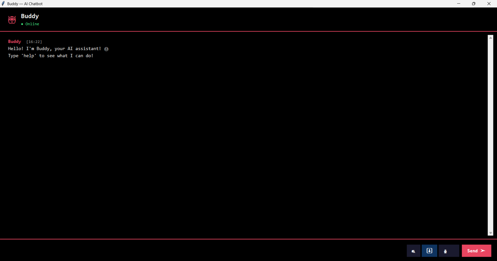
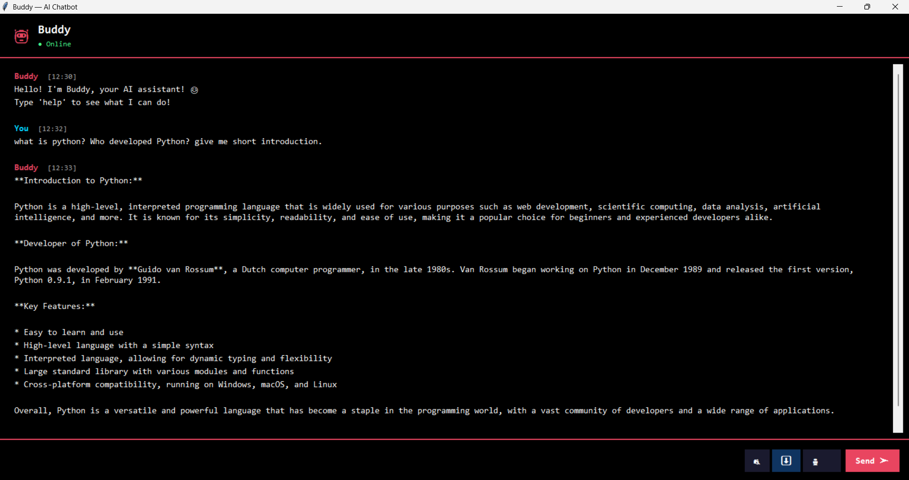
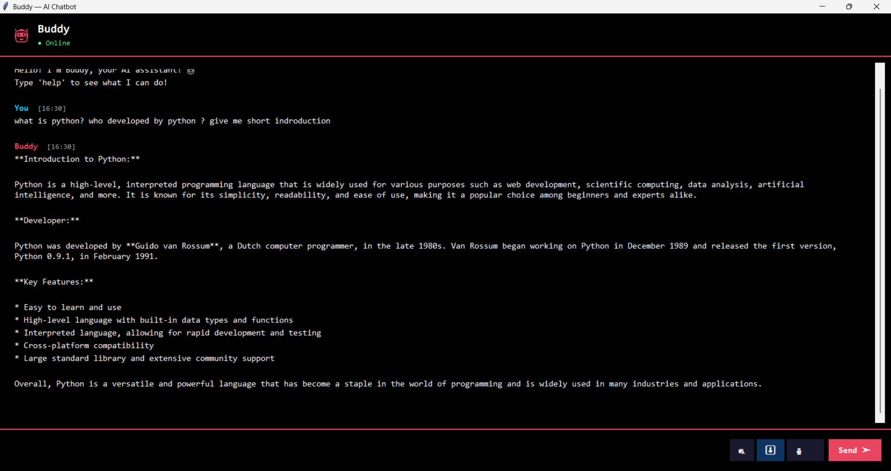
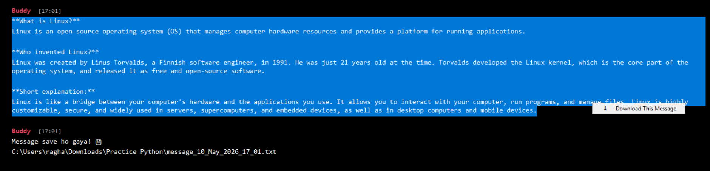

# 🤖 AI Chatbot with GUI

AI Chatbot with GUI | Python, Tkinter, Groq API | 
Hindi & English Support | Voice & PDF Download

## Features
- 🤖 Groq AI (Llama 3.3 70B)
- 🎨 Dark Theme GUI
- 🎤 Voice Input & Output
- 💾 Chat PDF Download
- 🌐 Hindi & English Support
- 📅 Date & Time
- 😄 Jokes & Fun
- 😔 Emotional Support

## Tech Stack
- Python
- Tkinter
- Groq API
- pyttsx3
- SpeechRecognition
- fpdf2

## How to Run
### 1. Libraries Install Karo:
pip install groq pyttsx3 SpeechRecognition fpdf2

### 2. API Key Lo:
- https://console.groq.com pe jao
- Free account banao
- API key lo

### 3. Environment Variable Set Karo:
# Windows
set GROQ_API_KEY="teri_api_key_yahan"

### 4. Run Karo:
python ai_chatbot.py

## Screenshots---->

#-----------------------------------------------------

#-----------------------------------------------------

   
